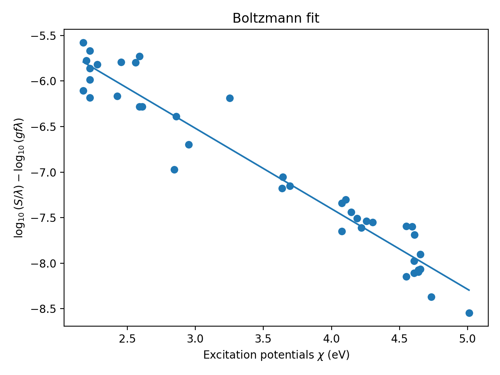

# Stellar Spectrum Analysis – Excitation Temperature from Absorption Lines

This project implements a numerical analysis of stellar absorption lines to extract an excitation temperature proxy using the weak-line approximation.

The workflow follows a typical computational physics lab structure: data processing, numerical integration, filtering, and regression analysis.

---

## Objective

To compute equivalent widths of selected absorption lines and determine the slope of the Boltzmann-type relation between line strength and excitation potential.

Under simplifying assumptions, this slope is proportional to the inverse excitation temperature of the star.

---

## Method

### 1. Equivalent Width Calculation

For each line center λ₀ from the provided line list, an integration window

[λ₀ − Δλ, λ₀ + Δλ]

is applied to the spectrum.

The equivalent width is computed numerically as

S = ∫ (1 − F(λ)) dλ

using trapezoidal quadrature.

### 2. Weak-Line Approximation

In the linear (weak-line) regime of the curve of growth, the transformed quantity

y = log10(S / λ) − log10(λ) − log(gf)

is linearly related to the excitation potential χ:

y = m χ + b

Only sufficiently weak lines are retained via a strength threshold to ensure validity of this approximation.

### 3. Linear Regression

A least-squares fit is performed to determine the slope m.

---

## Numerical Techniques

- Masked window integration
- Trapezoidal numerical quadrature (SciPy)
- Vectorized filtering (NumPy)
- Linear least-squares regression (NumPy)

---

## Input Data

- `spectrum.dat`: wavelength, flux  
- `LineList.dat`: wavelength, log(gf), excitation potential χ (eV)

The input data files are not included in this repository.
Provide a spectrum file and line list in the specified format to reproduce results.

---

## Running the Code

Install dependencies:
pip install -r requirements.txt

Run:
python main.py

The script prints the fitted slope and displays the regression plot.

---

## Example Output

---

## Assumptions and Limitations

- Valid only in the weak-line regime.
- Strong or saturated lines are excluded via thresholding.
- The result represents an excitation-temperature proxy under simplified LTE assumptions.